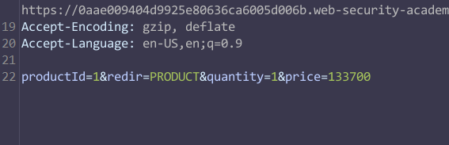
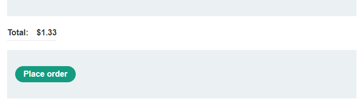

[Lab - Excessive trust in client-side controls](https://portswigger.net/web-security/logic-flaws/examples/lab-logic-flaws-excessive-trust-in-client-side-controls)

This lab doesn't adequately validate user input. You can exploit a logic flaw in its purchasing workflow to buy items for an unintended price. To solve the lab, buy a "Lightweight l33t leather jacket".

You can log in to your own account using the following credentials: `wiener:peter`

---
## Solution

- Open the product: Lightweight l33t leather jacket
- Turn on the Intercept
- Add to cart 
- - 
- now change the price to  `133`
- go to card and u will see
- 
- Place an order
- Congratulations, you solved the lab!