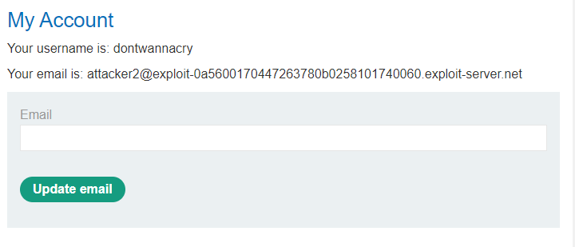
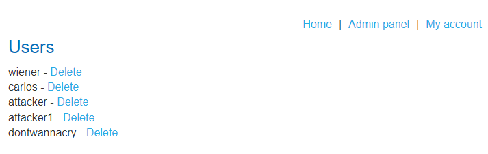

# [Lab - Inconsistent security controls](https://portswigger.net/web-security/logic-flaws/examples/lab-logic-flaws-inconsistent-security-controls)

This lab's flawed logic allows arbitrary users to access administrative functionality that should only be available to company employees. To solve the lab, access the admin panel and delete the user `carlos`.

---
## Solution
- Register an account
- 
- you will get a option to update your email address
- update email with `DontWannaCry@dontwannacry.com`
- 
- now visit admin panel, u will get a option to delete carlos
